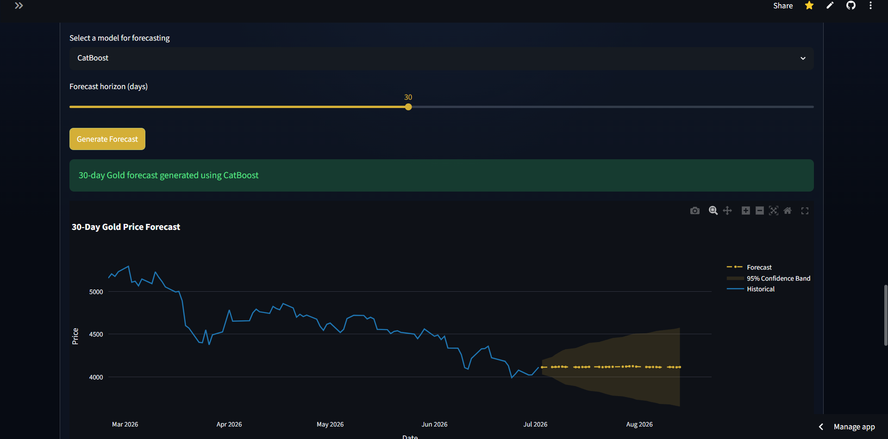
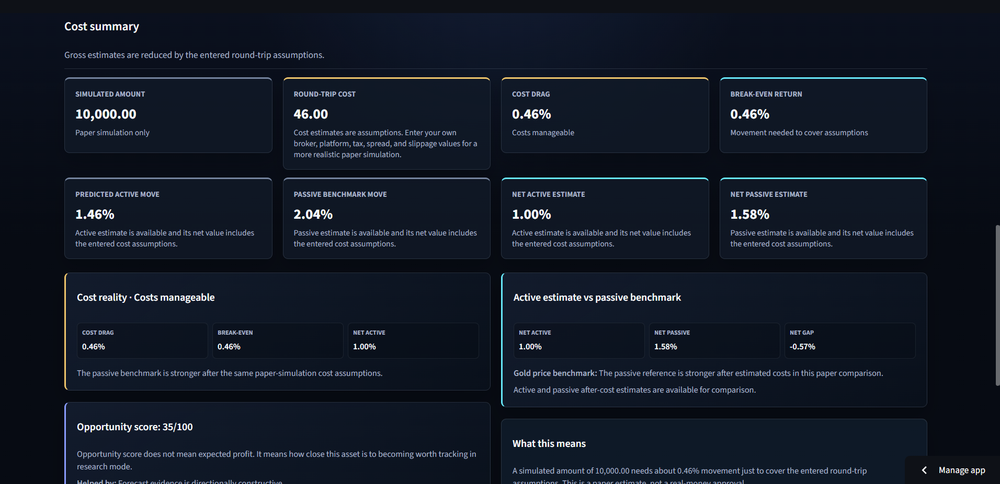
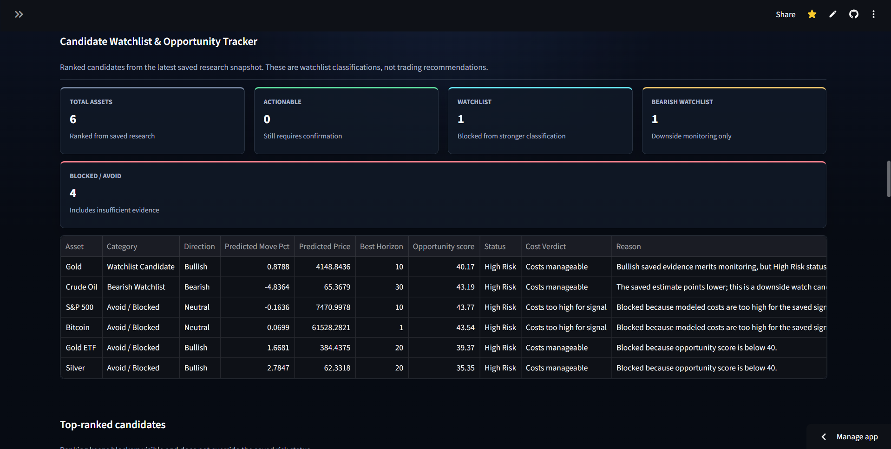
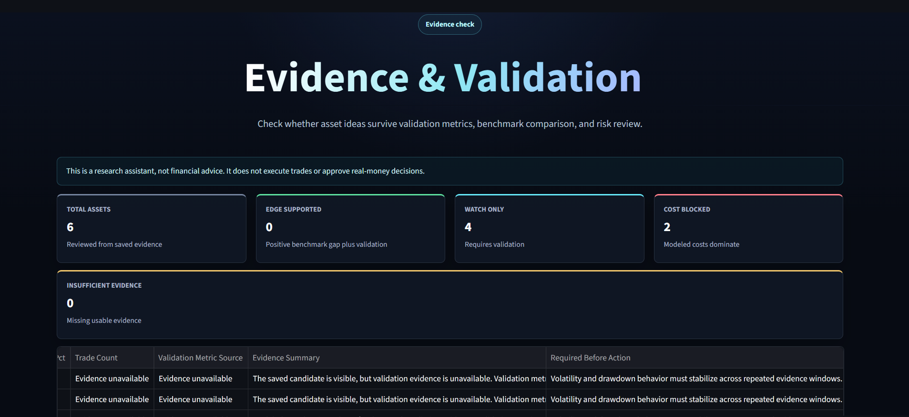

# Multi-Asset Quant Research Platform

[](https://www.python.org/)
[](https://streamlit.io/)
[](https://github.com/poojanbhardwaj/GoldPricePrediction-QuantSystem/actions)
[](#safety-and-limitations)

A deployed, research-only multi-asset quantitative research platform for studying market forecasts, evidence quality, cost/risk constraints, and paper-research plans across **Gold, Silver, Crude Oil, Bitcoin, S&P 500, and GLD**.

The project is designed as a portfolio-grade Streamlit application, not a notebook demo. It combines data refresh, model training, model comparison, diagnostic forecasting, candidate ranking, evidence validation, cost-aware planning, saved research history, and an auth-gated research workspace.

> **Important:** This project is for research and education only. It is not financial advice, does not execute trades, does not connect to brokers, and does not make buy/sell recommendations.

---

## Live Demo
[Live Streamlit App](https://multi-asset-quant-system.streamlit.app/)

---

## Screenshots

Screenshots from the deployed research workspace:

| View | Screenshot |
|---|---|
| Research Dashboard |  |
| Refresh / Rebuild Research |  |
| Advanced Diagnostics |  |
| Train Models |  |
| Compare Models |  |
| 30-Day Diagnostic Forecast |  |
| Cost & Risk Plan |  |
| Candidate Watchlist |  |
| Evidence & Validation |  |

---

## Key Features

- **Multi-asset research dashboard** for Gold, Silver, Crude Oil, Bitcoin, S&P 500, and GLD.
- **Market data refresh / rebuild workflow** with visible source and freshness labels.
- **Model training workflow** for chronological forecasting experiments.
- **Model comparison dashboard** with validation metrics and baseline checks.
- **30-day diagnostic forecast view** for visual model inspection.
- **Cost & Risk Plan** to show break-even return, cost drag, active/passive estimates, and missing-dependency explanations.
- **Candidate Watchlist** that ranks research ideas while keeping blockers and weak evidence visible.
- **Evidence & Validation** views for checking whether an idea survives validation, benchmark, and risk review.
- **Saved research plans and research history** for user-owned paper-research tracking.
- **Advanced Diagnostics** for source freshness, snapshots, artifact integrity, model training, and forecast debugging.
- **Auth-gated workspace** with public preview, local development auth, and optional Supabase verified-email mode.
- **Automated regression tests** covering product flows, auth, navigation, diagnostics, snapshot handling, and safety wording.

---

## System Architecture

```text
Market Data / Saved Research Snapshots
        |
        v
Data Loading -> Feature Engineering -> Model Training / Forecasting
        |                    |                 |
        v                    v                 v
Source Freshness       Validation Evidence   Model Diagnostics
        |                    |                 |
        +--------- Risk, Cost, Benchmarks -----+
                          |
                          v
          Candidate Watchlist + Evidence Review
                          |
                          v
        Personalized Paper-Research Plans / History
                          |
                          v
                 Streamlit Product Workspace
```

Primary modules include:

- `data_loader` for market data loading and cache handling.
- `feature_engineering` and `feature_intelligence` for time-series features.
- `model_training_workflow` for app-level training orchestration.
- `predict` and forecasting utilities for diagnostic forecast generation.
- `final_user_dashboard` for snapshot and user-facing research plans.
- `candidate_watchlist` and `evidence_of_edge` for candidate ranking and validation.
- `cost_aware_plan` for cost drag, break-even, and active/passive comparison.
- `auth_manager`, `user_platform`, and `research_history` for user workspace and saved research.

---

## Validation and Safety Design

This project intentionally avoids misleading “trading bot” claims. It includes:

- Time-ordered workflow design for market research.
- Leakage-aware validation and baseline comparisons.
- Source-date, freshness, cached/saved/refreshed snapshot labels.
- Cost and risk checks before any paper-research idea is surfaced strongly.
- Candidate rejection visibility instead of hiding weak results.
- Auth-gated user workspace for saved goals and research plans.
- No broker connection.
- No bank or trading-account credential collection.
- No real-money execution.
- No guaranteed return language.
- No financial advice.

---

## Tech Stack

| Layer | Tools |
|---|---|
| App | Streamlit |
| Language | Python |
| Data | Pandas, NumPy |
| ML | scikit-learn, XGBoost, LightGBM, CatBoost |
| Visualization | Plotly, Streamlit components |
| Storage | SQLite local fallback, CSV artifact store |
| Auth | Local development auth, optional Supabase verified-email mode |
| Testing | pytest, compile checks |
| Deployment | Streamlit Cloud, GitHub Actions |

---

## Local Setup

```powershell
git clone https://github.com/poojanbhardwaj/GoldPricePrediction-QuantSystem.git
cd GoldPricePrediction-QuantSystem

python -m venv .venv
.\.venv\Scripts\Activate.ps1

python -m pip install --upgrade pip
python -m pip install -r requirements.txt

streamlit run app.py
```

The app works without Supabase in **local development auth mode**. Supabase is optional and should be configured only through untracked secrets.

---

## Optional Supabase Configuration

Copy `.streamlit/secrets.example.toml` to the untracked `.streamlit/secrets.toml` and provide:

```toml
SUPABASE_URL = "https://your-project.supabase.co"
SUPABASE_ANON_KEY = "your-anon-key"
```

Use the public anon key only. Never commit `.streamlit/secrets.toml`, `.env`, database files, private exports, service-role keys, or generated runtime artifacts.

---

## Testing

```powershell
python -m compileall app.py src
python -m pytest tests -q
```

The project includes automated tests for:

- Product navigation and page routing.
- Public/authenticated workspace behavior.
- Snapshot loading and fallback behavior.
- Advanced diagnostics and training workflow.
- Candidate watchlist and evidence views.
- Cost/risk plan logic.
- Safety wording and no-execution constraints.
- Regression-prone Streamlit UI states.

---

## Deployment

The app is designed for Streamlit Cloud.

Deployment notes:

- Secrets must be configured in Streamlit Cloud settings, not committed to Git.
- Saved/cached snapshots must be labeled honestly.
- Runtime-generated files should not be committed unless intentionally reviewed.
- Generated data files, local databases, and private user exports should stay out of Git.

---

## Safety and Limitations

This project is **research-only**.

It does not:

- Provide financial advice.
- Execute trades.
- Connect to brokers.
- Collect broker, bank, or trading-account credentials.
- Guarantee profits or returns.
- Claim real-time prices when the data is cached, saved, delayed, or refreshed from an external source.

Predictions are uncertain research estimates. Market data can be delayed, incomplete, or unavailable. Any displayed result should be treated as paper-research evidence, not an investment instruction.

---

## Roadmap

- Improve production persistence beyond local SQLite fallback.
- Add deeper portfolio attribution and monitoring views.
- Expand research-history comparison and change tracking.
- Add non-execution research alerts.
- Maintain updated screenshots and demo script as the product evolves.

---

## Recruiter Demo Script

A strong five-minute walkthrough:

1. Open the public dashboard and explain the research-only purpose.
2. Show the multi-asset dashboard and source/freshness labels.
3. Refresh/rebuild research and explain snapshot provenance.
4. Open Advanced Diagnostics and show model training.
5. Show Compare Models and 30-Day Diagnostic Forecast.
6. Open Candidate Watchlist and Evidence & Validation.
7. Open Cost & Risk Plan and explain cost drag / break-even return.
8. End with saved research plans/history and safety limitations.

---


