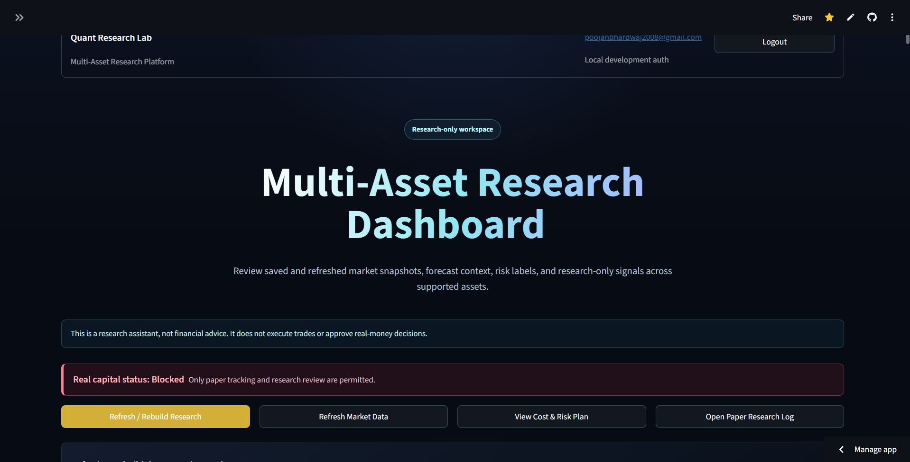
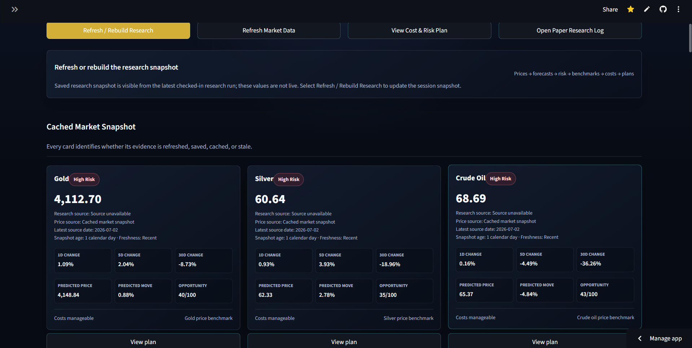
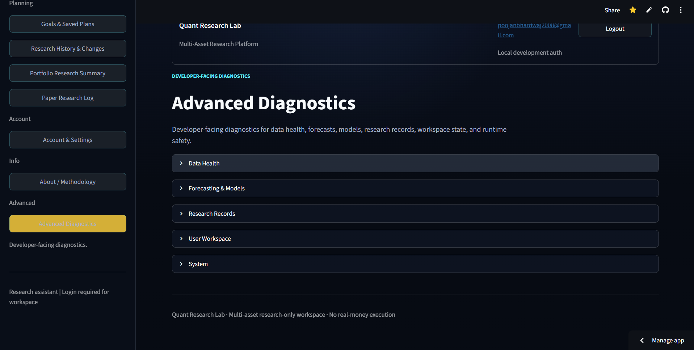
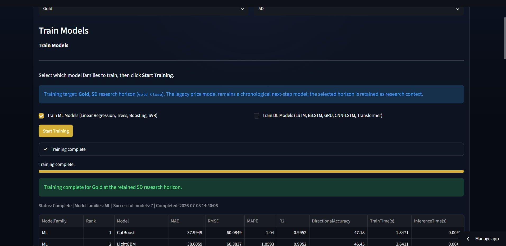
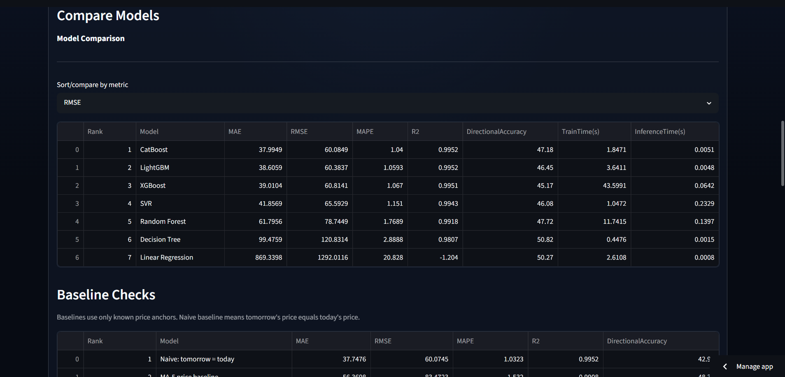

# Multi-Asset Quant Research Platform

[](https://www.python.org/)
[](https://streamlit.io/)
[](https://github.com/poojanbhardwaj/GoldPricePrediction-QuantSystem/actions)
[](#safety-and-limitations)
[](#deployment)

A deployed, research-only **Multi-Asset Quantitative Research Platform** for studying market forecasts, evidence quality, model reliability, cost/risk constraints, and paper-research plans across **Gold, Silver, Crude Oil, Bitcoin, S&P 500, and GLD**.

This is not a notebook-only price predictor. It is a portfolio-grade ML systems project with a Streamlit product interface, multi-asset data workflow, feature engineering, model training, model comparison, forecast diagnostics, artifact-based research snapshots, model registry, risk-aware planning, candidate watchlists, validation views, saved research history, and deployment-safe behavior.

> **Important:** This project is for research and education only. It is not financial advice, does not execute trades, does not connect to brokers, and does not make buy/sell recommendations.

---

## Live Demo

**Streamlit App:**  
https://multi-asset-quant-system.streamlit.app/

**Stable Release:**  
`v1.0-stable`

---

## Project Summary

This project was built as an end-to-end ML systems project for financial time-series research.

It focuses on:

- Multi-asset market data processing.
- Time-series feature engineering.
- Classical ML and optional deep learning model training.
- Shared model registry for comparison and forecast readiness.
- Actual-vs-predicted diagnostics.
- 30-day research forecast views.
- Risk-aware and cost-aware research planning.
- Candidate ranking and evidence review.
- Saved research plans and research history.
- Artifact-based dashboard reliability.
- Streamlit Cloud deployment.
- Safety-first research-only communication.

The purpose is **not** to claim guaranteed market prediction. The purpose is to create a repeatable research workflow that helps compare models, inspect evidence quality, surface uncertainty, and avoid misleading dashboard outputs.

---

## Screenshots

Screenshots from the deployed research workspace:

| View | Screenshot |
|---|---|
| Research Dashboard |  |
| Refresh / Rebuild Research |  |
| Advanced Diagnostics |  |
| Train Models |  |
| Compare Models |  |
| Actual vs Predicted |  |
| 30-Day Diagnostic Forecast |  |
| Cost & Risk Plan |  |
| Candidate Watchlist |  |
| Evidence & Validation |  |

---

## Key Features

### Multi-Asset Research Dashboard

The dashboard supports research views across:

- Gold
- Silver
- Crude Oil
- Bitcoin
- S&P 500
- GLD

It shows market snapshots, saved research estimates, prediction ranges, freshness labels, opportunity scores, risk labels, and explanation panels.

### Market Data Workflow

The project includes a market data refresh and rebuild workflow with visible diagnostics for:

- Data source
- Latest available date
- Cached vs refreshed state
- Saved snapshot state
- Artifact loading
- Prediction availability
- Data freshness

### Feature Engineering

The platform builds time-series features using:

- Technical indicators
- Momentum features
- Volatility features
- Lagged returns
- Rolling statistics
- Calendar features
- Cross-asset signals
- Macro/factor-style inputs when available

### Model Training Workflow

The training workflow supports chronological forecasting experiments and avoids treating financial time series like randomly shuffled tabular data.

It supports:

- Train/validation/test splits
- Time-aware preprocessing
- Train-only scaler fitting
- Multiple model families
- Registry update after training
- Forecast-readiness checks
- Failure/warning reasons for unavailable models

### Shared ML/DL Model Registry

The app includes a shared model registry that connects:

- Train Models
- Compare Models
- Actual-vs-Predicted diagnostics
- 30-Day Forecast
- Forecast readiness
- Model availability warnings

This prevents each page from having separate disconnected model logic.

### Model Comparison Dashboard

The comparison view tracks:

- RMSE
- MAE
- MAPE
- R²
- Direction Accuracy
- Model family
- Asset
- Horizon
- Target mode
- Sequence length
- Forecast readiness
- Training timestamp

### Forecast Diagnostics

The app includes diagnostic forecast views to inspect model behavior visually. These are designed for research and model debugging, not trading instructions.

### Cost and Risk Planning

The platform includes cost-aware planning logic for:

- Cost drag
- Break-even estimate
- Gross vs net active estimate
- Passive comparison
- Risk labels
- Missing dependency explanations
- Research-only plan generation

### Candidate Watchlist and Evidence Review

The watchlist ranks candidate research ideas while keeping weak evidence, missing data, and validation blockers visible. This avoids hiding failed or low-confidence research results.

### Auth-Gated Workspace

The app supports:

- Public preview mode
- Local development auth mode
- Optional Supabase verified-email mode
- Saved user research plans
- Research history

### Deployment Diagnostics

The app includes diagnostics for:

- Snapshot loading
- Artifact integrity
- Model registry availability
- Prediction detection
- Data freshness
- Forecast readiness
- Missing optional dependencies

---

## Supported Assets

| Asset | Role in Platform |
|---|---|
| Gold | Primary precious metals research asset |
| Silver | Secondary precious metals research asset |
| Crude Oil | Energy market research asset |
| Bitcoin | Crypto market research asset |
| S&P 500 | Broad equity market research asset |
| GLD | Gold ETF proxy and cross-check asset |

The project is designed as a **multi-asset research system**, not only a Gold prediction script.

---

## Supported Models

| Type | Models |
|---|---|
| Classical ML | Linear Regression, Decision Tree, Random Forest, SVR |
| Gradient Boosting | XGBoost, LightGBM, CatBoost |
| Optional Deep Learning | LSTM, BiLSTM, GRU, CNN-LSTM, Transformer |

Deep learning support is optional because TensorFlow can be heavy in cloud environments. The app is designed to degrade safely: if TensorFlow is unavailable, DL models show clear warnings instead of crashing the deployed dashboard.

---

## Shared Model Registry

The model registry is one of the core engineering components of the project.

It tracks:

- Model display name
- Model name
- Model family: ML or DL
- Asset
- Horizon
- RMSE
- MAE
- MAPE
- R²
- Direction Accuracy
- Target transformation mode
- Sequence length
- Forecast readiness flag
- Training timestamp
- Failure or warning reason

The registry allows the app to compare classical ML models and optional sequence models in one workflow. It also prevents forecast pages from using incomplete, unavailable, or failed model outputs.

---

## System Architecture

```text
Market Data / Saved Research Snapshots
        |
        v
Data Loading
        |
        v
Feature Engineering + Feature Intelligence
        |
        v
Time-Series Preprocessing
        |
        v
ML / Optional DL Model Training
        |
        v
Shared Model Registry
        |
        +----------------------+
        |                      |
        v                      v
Model Comparison        Forecast Diagnostics
        |                      |
        +----------+-----------+
                   |
                   v
        Risk, Cost, Benchmark Checks
                   |
                   v
        Candidate Watchlist + Evidence Review
                   |
                   v
        Saved Research Plans + History
                   |
                   v
          Streamlit Research Workspace
```

---

## Important Modules

| Module | Purpose |
|---|---|
| `app.py` | Main Streamlit application and product workflow |
| `src/data_loader.py` | Market data loading and cache handling |
| `src/feature_engineering.py` | Core time-series feature generation |
| `src/feature_intelligence.py` | Advanced feature intelligence layer |
| `src/preprocessing.py` | Time-aware preprocessing and train/validation/test preparation |
| `src/train.py` | Classical ML model training |
| `src/train_dl.py` | Optional deep learning model training |
| `src/model_training_workflow.py` | App-level model training orchestration |
| `src/trained_model_registry.py` | Shared ML/DL model registry |
| `src/prediction.py` | Prediction and forecast utilities |
| `src/final_user_dashboard.py` | Final dashboard and user-facing research plans |
| `src/candidate_watchlist.py` | Candidate research ranking |
| `src/evidence_of_edge.py` | Evidence and validation checks |
| `src/cost_aware_plan.py` | Cost-aware plan calculations |
| `src/auth_manager.py` | Authentication mode handling |
| `src/research_history.py` | Saved research history |

---

## Validation and Safety Design

This project intentionally avoids misleading “trading bot” claims.

It includes:

- Time-ordered workflow design.
- Train/validation/test separation.
- Train-only scaler fitting.
- Walk-forward validation support.
- Baseline comparison support.
- Model diagnostics instead of blind forecast display.
- Source-date and freshness labels.
- Saved/refreshed/cached snapshot labels.
- Prediction availability checks.
- Forecast readiness flags.
- Candidate rejection visibility.
- Cost and risk checks.
- Clear optional dependency warnings.
- No broker connection.
- No trade execution.
- No financial credential collection.
- No guaranteed return language.
- No financial advice.

---

## Data Integrity and Deployment Safety

Financial data pipelines can fail because external providers may rate-limit, delay, or temporarily return incomplete data.

The platform includes safety-oriented behavior such as:

- Snapshot loading diagnostics.
- Artifact-based dashboard fallback.
- Prediction snapshot validation.
- Placeholder prediction detection.
- Source freshness labels.
- Cached/saved/refreshed state labels.
- Optional TensorFlow handling.
- Clear warnings when models are unavailable.
- Research-only disclaimers.

Important project rule:

> If market data refresh fails or appears suspicious, model outputs should not be treated as reliable research evidence.

Future hardening includes stronger automatic blocking of model training when suspicious fallback or synthetic data is detected.

---

## Representative Research Output

The platform can generate model-comparison and forecast-readiness tables such as:

| Asset | Horizon | Model Family | Metrics |
|---|---:|---|---|
| Gold | 30D | ML / Optional DL | RMSE, MAE, MAPE, R², Direction Accuracy |
| Silver | 30D | ML / Optional DL | RMSE, MAE, MAPE, R², Direction Accuracy |
| Crude Oil | 30D | ML / Optional DL | RMSE, MAE, MAPE, R², Direction Accuracy |
| Bitcoin | 30D | ML / Optional DL | RMSE, MAE, MAPE, R², Direction Accuracy |
| S&P 500 | 30D | ML / Optional DL | RMSE, MAE, MAPE, R², Direction Accuracy |
| GLD | 30D | ML / Optional DL | RMSE, MAE, MAPE, R², Direction Accuracy |

The goal is to support repeatable research comparison, not to claim guaranteed price prediction.

---

## Tech Stack

| Layer | Tools |
|---|---|
| App | Streamlit |
| Language | Python 3.11 |
| Data Processing | Pandas, NumPy |
| Machine Learning | scikit-learn, XGBoost, LightGBM, CatBoost |
| Optional Deep Learning | TensorFlow / Keras |
| Visualization | Plotly, Streamlit components |
| Storage | CSV artifact store, SQLite local fallback |
| Auth | Local development auth, optional Supabase verified-email mode |
| Testing | pytest, compile checks |
| Deployment | Streamlit Cloud |
| Version Control | Git, GitHub |

---

## Local Setup

```powershell
git clone https://github.com/poojanbhardwaj/GoldPricePrediction-QuantSystem.git
cd GoldPricePrediction-QuantSystem

python -m venv .venv
.\\.venv\\Scripts\\Activate.ps1

python -m pip install --upgrade pip
python -m pip install -r requirements.txt

streamlit run app.py
```

The app works without Supabase in local development auth mode. Supabase is optional.

---

## Optional Supabase Configuration

Copy:

```text
.streamlit/secrets.example.toml
```

to the untracked file:

```text
.streamlit/secrets.toml
```

Then provide:

```toml
SUPABASE_URL = "https://your-project.supabase.co"
SUPABASE_ANON_KEY = "your-anon-key"
```

Use the public anon key only.

Never commit:

- `.streamlit/secrets.toml`
- `.env`
- database files
- private exports
- service-role keys
- generated runtime artifacts
- broker credentials
- bank credentials
- trading-account credentials

---

## Testing

```powershell
python -m compileall app.py src
python -m pytest tests -q
```

The test suite covers:

- Product navigation and page routing.
- Public/authenticated workspace behavior.
- Snapshot loading and fallback behavior.
- Advanced diagnostics.
- Training workflow behavior.
- Candidate watchlist logic.
- Evidence views.
- Cost/risk plan logic.
- Safety wording.
- No-execution constraints.
- Regression-prone Streamlit UI states.

---

## Deployment

The app is designed for Streamlit Cloud.

Deployment notes:

- Secrets must be configured in Streamlit Cloud settings.
- Secrets must not be committed to Git.
- Saved/cached snapshots must be labeled honestly.
- Runtime-generated files should not be committed unless intentionally reviewed.
- Optional TensorFlow/DL support may be disabled on cloud deployments to keep the app stable and lightweight.
- The stable release tag is `v1.0-stable`.

---

## Resume Highlights

This project demonstrates:

- End-to-end ML systems design.
- Multi-asset financial time-series modeling.
- Streamlit product engineering.
- Shared model registry design.
- Forecast diagnostics.
- Model comparison workflows.
- Artifact-based dashboard reliability.
- Risk-aware and cost-aware research planning.
- Cloud deployment debugging.
- Responsible communication for uncertain financial ML outputs.

Example resume bullets:

```text
Built and deployed a Multi-Asset Quantitative Research Platform using Python, Streamlit, scikit-learn, XGBoost, LightGBM, CatBoost, and optional TensorFlow across Gold, Silver, Crude Oil, Bitcoin, S&P 500, and GLD.

Designed a shared ML/DL model registry that unifies model training, model comparison, actual-vs-predicted diagnostics, and 30-day forecasting workflows.

Implemented artifact-based research snapshots, risk-aware signals, cost-aware evaluation, deployment diagnostics, and safety-first research-only constraints.
```

---

## Safety and Limitations

This project is research-only.

It does not:

- Provide financial advice.
- Execute trades.
- Connect to brokers.
- Collect broker, bank, or trading-account credentials.
- Guarantee profits or returns.
- Claim real-time prices when the data is cached, saved, delayed, or refreshed from an external source.
- Recommend real-money buying or selling.

Predictions are uncertain research estimates. Market data can be delayed, incomplete, unavailable, or affected by provider limitations. Any displayed result should be treated as paper-research evidence, not an investment instruction.

---

## Future Work

- Strengthen dataset integrity checks before model training.
- Improve production persistence beyond local SQLite fallback.
- Add deeper portfolio attribution and monitoring views.
- Expand research-history comparison and change tracking.
- Add richer benchmark models for naive, moving-average, and market-regime baselines.
- Add more automated tests for model registry and artifact loading.
- Improve model-card style explanations for each trained model.
- Add better handling for external data-provider rate limits.

---

## License and Usage

This repository is intended for educational and portfolio use.

Use responsibly. Do not use this project as a real-money trading system without independent validation, professional risk controls, and compliance review.
